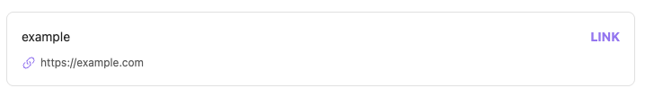
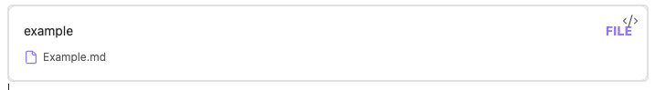
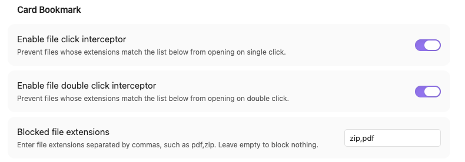

# Card Bookmark

Card Bookmark is an Obsidian plugin for turning links and file paths into card-style bookmarks.

It provides three main features:

- Link bookmarks: insert a code block for a URL and render it as a card.
- File bookmarks: insert a code block for a vault-relative path and render it as a card.
- File-explorer click interception: block opening specific file types in the file explorer.

## Usage

### Link bookmark

1. Open the command palette.
2. Run `Add a link bookmark`.
3. Enter an optional title and a valid URL.
4. Insert the generated `link_bookmark_block` code block into your note.

Example:

````markdown
```link_bookmark_block
link: https://example.com
title: Example
```
````



### File bookmark

1. Open the command palette.
2. Run `Add a file bookmark`.
3. Enter an optional title and a vault-relative path.
4. Insert the generated `file_bookmark_block` code block into your note.

Example:

````markdown
```file_bookmark_block
path: Projects/notes/example.md
title: Example note
```
````



### File-explorer click interception

This plugin can block file opening in the file explorer based on file type.

- Enable single-click interception to block opening on click.
- Enable double-click interception to block opening on double click.
- Enter extensions as a comma-separated list, for example `pdf,zip,apk`.



## Tips

- Shortcuts: assigning hotkeys to both bookmark commands can greatly improve creation speed.
- File bookmarks: file bookmarks only support files inside the vault. If the path cannot be resolved, you will see an "invalid path" message.
- Copy file path: right-click a file and choose `Copy path - from vault folder` to quickly copy the file path.
- Interception: single click, double click, and file type are all configurable.

## Project structure

- `src/main.ts`: plugin lifecycle and feature registration
- `src/link_bookmark.ts`: link bookmark command and renderer
- `src/file_bookmark.ts`: file bookmark command and renderer
- `src/file_click_interceptor.ts`: file-explorer click interception
- `src/settings.ts`: settings model and settings tab
- `src/modal.ts`: bookmark creation modals
- `src/assets/`: static assets used by the plugin

